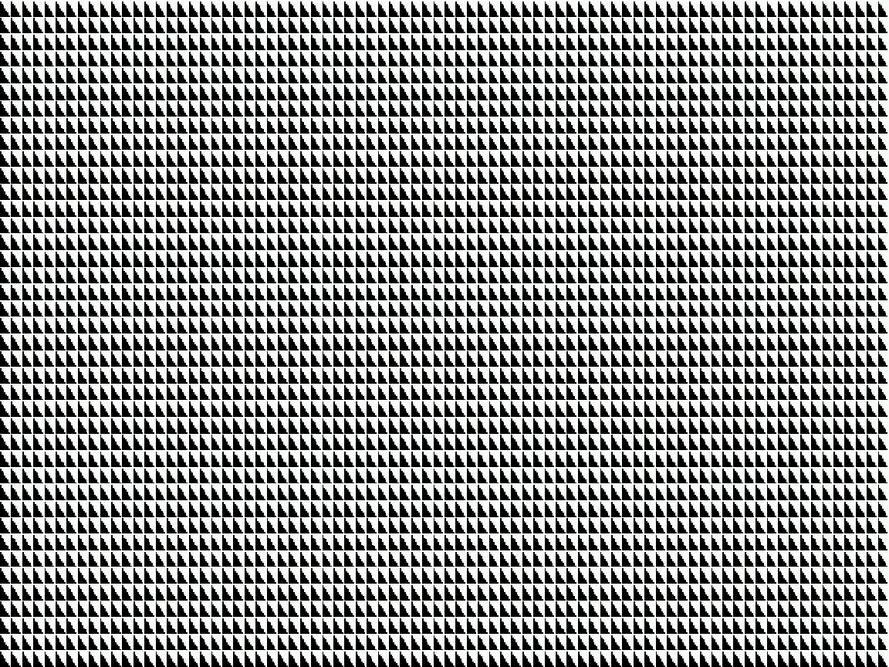
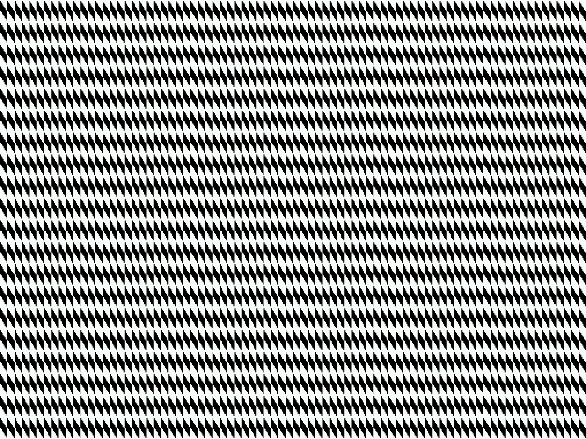
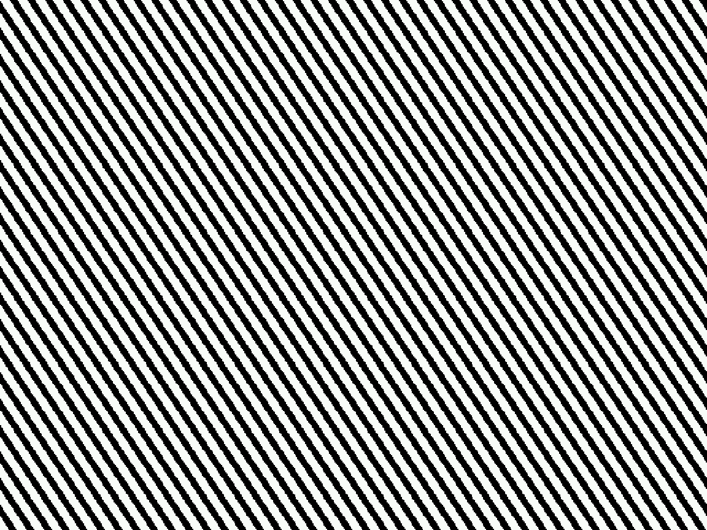
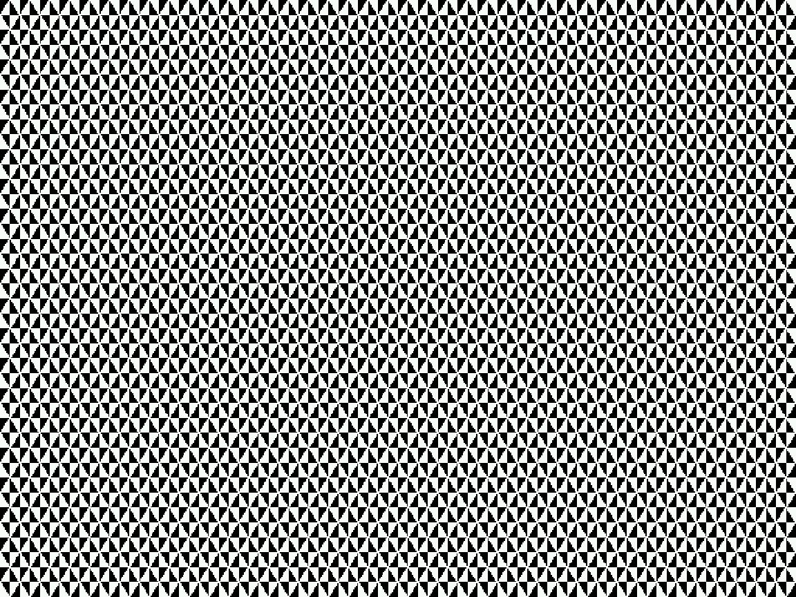
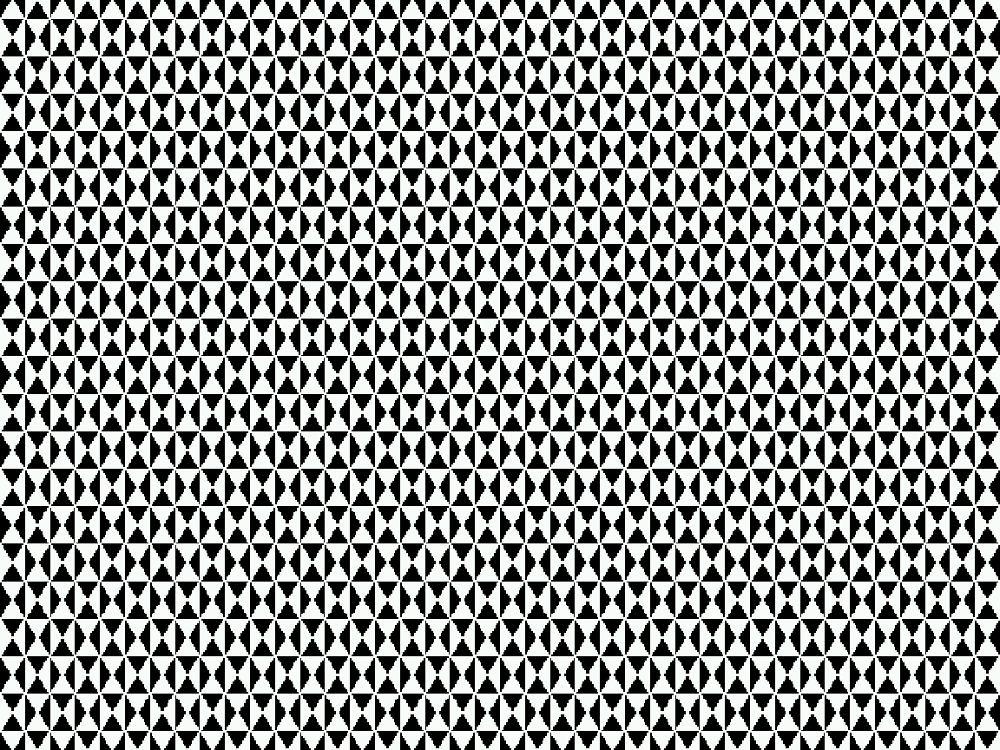
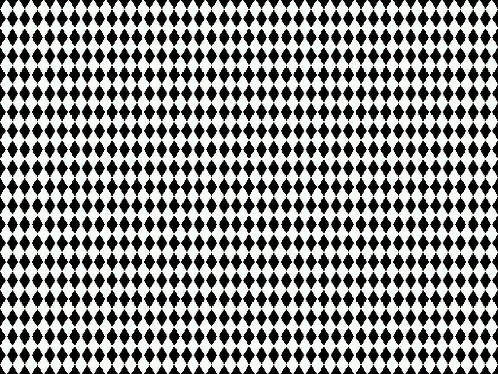

# Truchet Tile Pattern Generator

A demo application for the Zeal 8-bit computer that generates and displays animated [Truchet tiles](https://en.wikipedia.org/wiki/Truchet_tiles) using custom character graphics and DMA-based video memory transfers.

## What are Truchet Tiles?

Truchet tiles are square tiles decorated with patterns that can create complex, seemingly random designs when arranged in different orientations. This implementation uses quarter-circle patterns to create flowing, maze-like visuals.

## Features

- **Multiple Patterns**: Cycles through 6 different Truchet tile patterns
- **Custom Character Graphics**: Defines 4 custom font characters for quarter-circle tile rendering
- **DMA Transfers**: Uses Zeal's DMA peripheral for efficient video memory updates
- **Text Mode Graphics**: Renders patterns in 80×40 text mode by treating characters as tiles
- **Non-destructive**: Backs up and restores the original font data

## How It Works

The program:
1. Backs up the existing font characters (characters 1-4)
2. Replaces them with quarter-circle patterns (top-left, top-right, bottom-left, bottom-right)
3. Fills the screen using various tile arrangement patterns
4. Uses DMA to transfer the text and color buffers to video memory
5. Cycles through 6 different patterns with 1.5-second delays between each
6. Restores the original font and screen state when finished

## Patterns

The demo includes 6 distinct patterns:

### Pattern A: Single repeating tile (1×1)


### Pattern B: 2×2 uniform grid


### Pattern C: 2×2 alternating diagonal


### Pattern D: 2×2 complex arrangement


### Pattern E: 4×4 intricate design


### Pattern F: 2×2 inverted diagonal


## Building from Source

Make sure that you have [ZDE](https://github.com/zoul0813/zeal-dev-environment) installed.

Then open a terminal, go to the source directory and type the following commands:

```shell
zde cmake
```
